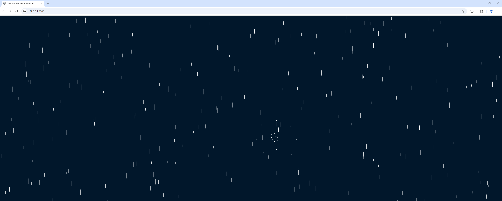

# Raindrops.js

A lightweight JavaScript raindrop animation effect — interactive and responsive, with raindrops that bounce off the mouse cursor. Great for fun background effects or visual demos.

---

### 🧠 How It Works

- A canvas element fills the screen, generating raindrops that fall from the top. Each frame:

- New drops are created

- The animation draws all drops

- Mouse interaction triggers splash effects

---

## 🚀 Features

---

- 🌧️ Smooth falling raindrop animation

- ☁️ Raindrops react to mouse movement

- 🎨 Simple HTML + CSS + JavaScript setup

- 🧠 Keeps animation performant and lightweight

---

## Screenshot



## 📦 Demo

### To see the effect in action:

- Clone or download this repository and open index.html in your browser.

## 💡 Installation

### Clone the repository:

```bash
git clone https://github.com/J-Magee0/Raindrops.js.git
```

### Open in browser:

- Double-click index.html or serve it locally:

```bash
npx live-server
```
